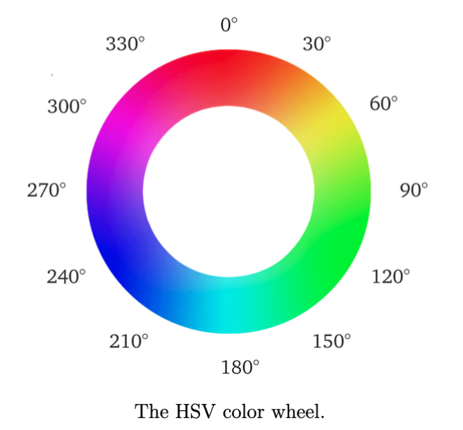

# ENGR 3410: Miniproject 1

**due February 13, 2025**

In this miniproject, you will use the OSS CAD suite to design a digital circuit to drive the RGB LED on your iceBlinkPico board so that it cycles through the colors at 60° intervals around the hue, saturation, value (HSV) color wheel (shown below) once per second.

This miniproject is an *individual* one. You can discuss design approaches and help each other with learning SystemVerilog and how to use the OSS CAD suite, but each of you must complete all aspects of this assignment in order to learn how to use the tools. In the process, you should learn several aspects of the processes and software tools that you will be using later in the semester to design more complex digital circuits.

## Requirements

Your design must meet the following requirements:

1. Your circuit must repeatedly drive the RGB LED on your iceBlinkPico board to cycle through the colors RED, YELLOW, GREEN, CYAN, BLUE, and MAGENTA in that order once per second.

2. Your circuit must be specified in one or more SystemVerilog source files.

## Deliverables

By the start of class on February 13, you must submit the following items to the course Canvas site:

1. Copies of all of the source files specifying your circuit. You may provide the URL of a Github repo or a shared folder containing your source files.

2. A video demo of your circuit working on your iceBlinkPico board.
