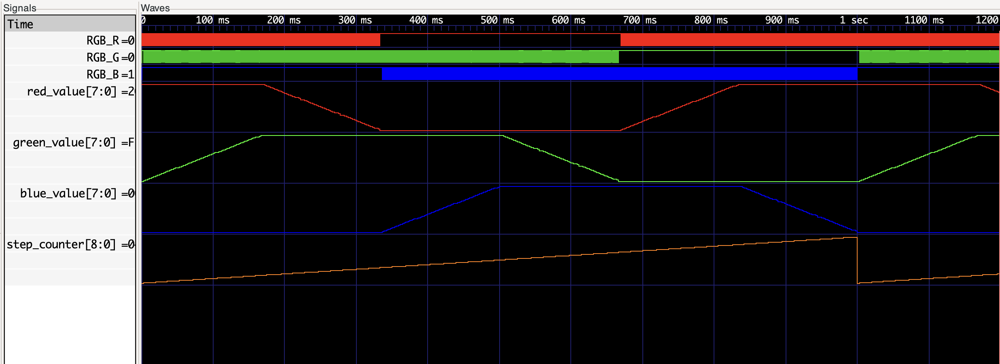

# Miniproject 2

Author: Enricco Gemha

Date: Mar 2nd, 2025

Link to demo video: [Miniproject 2 Demo](https://youtube.com/shorts/flgAmWVJgnE)

To check the assignment instructions, please refer to the [assignment page](./instructions.md).

## Design Overview

The circuit makes the RGB LED on the iceBlinkPico board cycle through all colors on the HSV wheel, by changing the brightness of the red, green, and blue LEDs over time to mix and create different colors.

## How It Works

The two main components of the circuit are:

1. **HSV Wheel Module**: Calculates what color to show at each moment. It divides the color wheel into 360 steps and goes through them to complete one full cycle per second.

2. **PWM Module**: Controls the brightness of each LED. When a value is 255, the LED is at full brightness, and when it's 0, the LED is off.

## Circuit Operation

The HSV color wheel is divided into 6 regions:

- Region 0: Red → Yellow (Red ━, Green ↑)
- Region 1: Yellow → Green (Red ↓, Green ━)
- Region 2: Green → Cyan (Green ━, Blue ↑)
- Region 3: Cyan → Blue (Green ↓, Blue ━)
- Region 4: Blue → Magenta (Blue ━, Red ↑)
- Region 5: Magenta → Red (Blue ↓, Red ━)

The circuit's position counter goes from 0 to 359, and based on it calculates the right brightness for each LED.

## Simulation Results

In this plot:

- The red, green, and blue values change smoothly over time
- One complete cycle takes 1 second
- The RGB values match what we expect for HSV color conversion

## Conclusion

This circuit successfully creates a smooth color wheel effect by using PWM to control LED brightness in the iceBlinkPico board's RGB LED.
