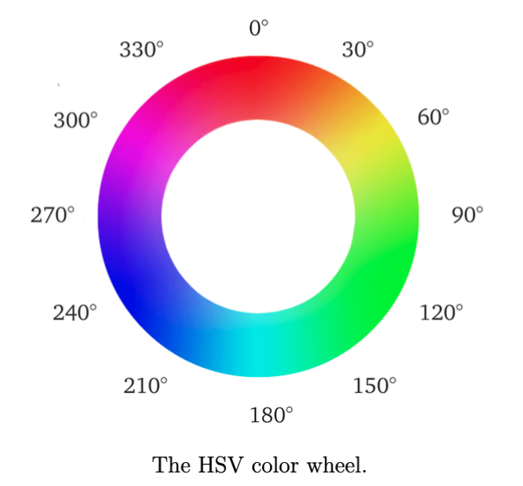
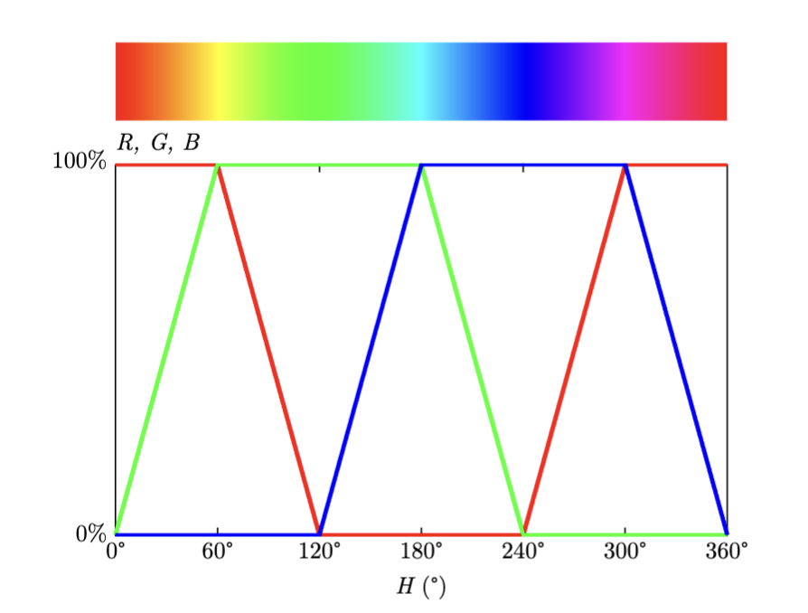

# ENGR 3410: Miniproject 2

**due February 27, 2025**

In this miniproject, you will use the OSS CAD suite to design a digital circuit to drive the RGB LED on your iceBlinkPico board so that it smoothly cycles through the colors around the HSV color wheel (shown below on the left) once per second by driving the individual LEDs using pulse width modulation (PWM) according to the waveforms shown below on the right.

- RGB components versus hue angle, H:

This miniproject is an individual one. You can discuss design approaches and help each other with learning SystemVerilog and how to use the OSS CAD suite, but each of you must complete all aspects of this assignment in order to learn how to use the tools. In the process, you should learn several aspects of the processes and software tools that you will be using later in the semester to design more complex digital circuits.

## Requirements

Your design must meet the following requirements:

1. Your circuit must repeatedly drive the RGB LED on your iceBlinkPico board with
PWM signals to cycle smoothly through the colors around the HSV color wheel once
per second according to the waveforms shown above.

2. Your circuit must be specified in one or more SystemVerilog source files.

3. You must provide a SystemVerilog test bench and simulation results using Icarus Verilog (iverilog) showing at least one complete cycle of your circuit’s operation.

## Deliverables

By the start of class on February 27, you must submit the following items
to the course Canvas site:

1. A PDF file containing a brief report explaining the design of your circuit and its operation. You should include a screen grab of a gtkwave plot showing the simulation of the RGB signal components changing as a function of time in your circuit.

2. Copies of all of the source files specifying your circuit as well as your test bench. You may provide the URL of a Github repo or a shared folder containing your source files.

3. A video demo of your circuit working on your iceBlinkPico board.
