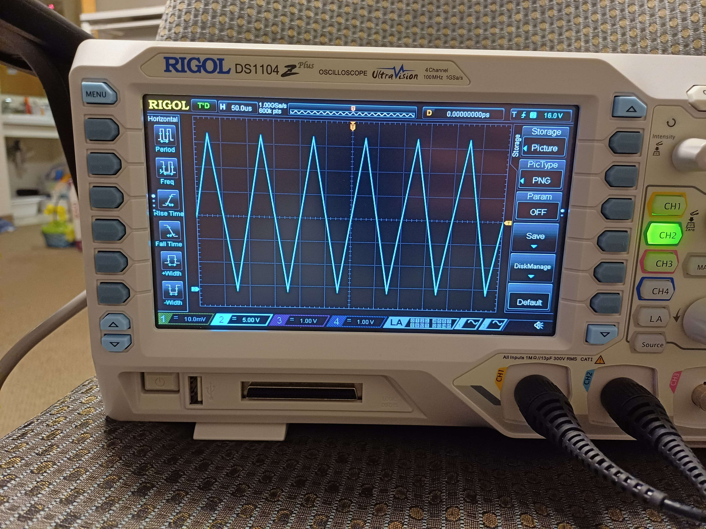
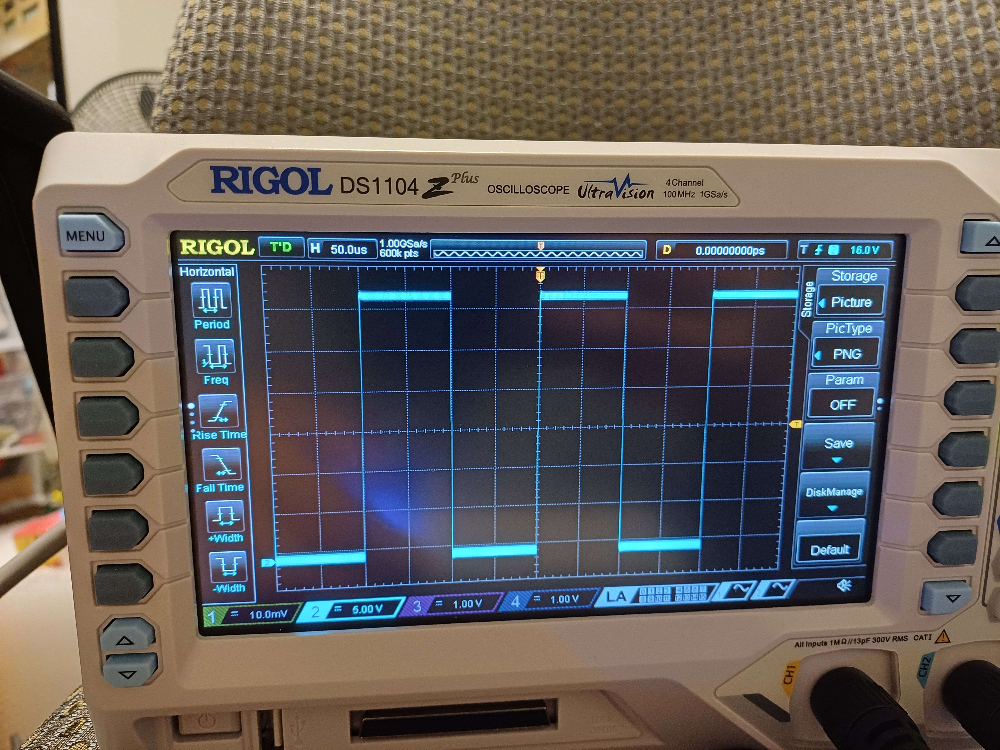

# Miniproject 5 - Enhanced Waveform Generator

Author: **Enricco Gemha, Owen Himsworth, Zhi Hong Khor**

Due: **May 7 2025**

For the full assignment brief, see the original [MP5 proposal](https://github.com/G3mha/Computer-Architecture/blob/main/miniproject05/README.pdf).

Repository: [Computer Architecture GitHub](https://github.com/G3mha/Computer-Architecture/tree/main/miniproject03%2B%2B)

---

## Circuit Design

This project expands the MP3 sine-wave by adding **square** and **triangle** outputs and on-board push-button control of frequency and waveform. A R-2R ladder DAC driven by the FPGA's GPIO produces the analogue waveform.

> The physical setup on the *iceBlinkPico* breadboard is shown below:
>
> 

Key design choices:

* **Quarter-wave memory** — a small on-chip block memory that stores 128 sine samples
* **32-bit phase accumulator** — updates every 12 MHz tick for ppm-level frequency resolution.
* **Button control** — BOOT cycles waveform (sine -> triangle -> square), SW cycles frequency (1 kHz -> 2 kHz -> 5 kHz -> 10 kHz).


---

## How It Works

   A 32-bit accumulator adds a selected *phase-increment* each 12 MHz clock cycle.

2. **Address Split**  
   The top 9 bits of the accumulator form:
   - a 2 bit *quadrant* (phase[8:7])  
   - a 7 bit *quarter-address* (phase[6:0])  
   For quadrants 1 and 3, the quarter-address is reversed (`127 - phase[6:0]`).

3. **Memory Lookup**  
   The quarter-address indexes the 128-word memory initialized with the first quarter-cycle of a sine wave.

4. **Waveform Reconstruction**  
   - **Sine:** Add or subtract the memory output from mid-scale (512) based on the quadrant.  
   - **Triangle:** Use the top bits of the accumulator to form a linear up/down ramp.  
   - **Square:** Replicate the MSB of the accumulator across all 10 bits.

5. **DAC Output**  
   The resulting 10-bit `dac_out` drives the R-2R ladder to produce a 0-3.5 V analogue signal.

---

## Symmetry Explanation

Using the symmetry of `sin(θ)` reduces the memory to one quarter-cycle. The four quadrants are handled as:

| Quadrant | Angle Range | Addressing  | Sign  |
| -------- | ----------- | ----------- | ----- |
| Q0       |  0° – 90°   | forward     | +     |
| Q1       |  90° – 180° | **reverse** | +     |
| Q2       | 180° – 270° | forward     | **-** |
| Q3       | 270° – 360° | **reverse** | **-** |

SystemVerilog snippet:

```systemverilog
module sine_gen(
    input  logic        clk,
    input  logic [8:0]   phase,    // 9-bit input: 0-511
    output logic [9:0]   out       // 10-bit output: centered around 512
);

    // Split phase into quadrant and index
    logic [1:0] quadrant;
    logic [6:0] quarter_address;
    logic [8:0] quarter_data;

    assign quadrant        = phase[8:7];
    assign quarter_address = (quadrant == 2'b01 || quadrant == 2'b11) ? (7'd127 - phase[6:0])
                                                                     : phase[6:0];

    // Quarter-cycle memory lookup
    memory_quarter #(
        .INIT_FILE("sine_quarter.txt")
    ) mem_inst (
        .clk(clk),
        .read_address(quarter_address),
        .read_data(quarter_data)
    );

    // Generate full-cycle sine from quarter lookup
    always_comb begin
        case (quadrant)
            2'b00, 2'b01: out = 10'd512 + quarter_data; // positive half
            2'b10, 2'b11: out = 10'd512 - quarter_data; // negative half
            default:      out = 10'd512;
        endcase
    end

endmodule
```

The same accumulator feeds a **triangle** generator (linear ramp using the MSBs) and a **square** generator (single MSB replicated).

---

## Simulation Results
For each experiment three figures are generated:

1. **Waveform Grid** – individual time traces for 1 kHz, 2 kHz, 5 kHz, 10 kHz.
2. **Frequency Spectra** – magnitude of the first 20 kHz of the FFT for each preset.
3. **Overlay Plot** – all four frequencies super-imposed to highlight phase/frequency scaling.

### Sine

| Time‑Domain                           | Frequency‑Domain                   | Subplots                            |
| ------------------------------------- | ---------------------------------- | ---------------------------------- |
|  |  |  |


### Triangle

| Time‑Domain                         | Frequency‑Domain                 | Subplots                          |
| ----------------------------------- | -------------------------------- | -------------------------------- |
|  |  |  |


### Square

| Time‑Domain                        | Frequency‑Domain                | Subplots                         |
| ---------------------------------- | ------------------------------- | ------------------------------- |
|  |  |  |


---

## Hardware Testing Testing


### Sine

| 1 kHz                                              | 2 kHz                                              | 5 kHz                                              | 10 kHz                                             |
|:--------------------------------------------------:|:--------------------------------------------------:|:--------------------------------------------------:|:--------------------------------------------------:|
|         |         |         |       |

### Triangle

| 1 kHz                                              | 2 kHz                                              | 5 kHz                                              | 10 kHz                                             |
|:--------------------------------------------------:|:--------------------------------------------------:|:--------------------------------------------------:|:--------------------------------------------------:|
|           |           |           |         |

### Square

| 1 kHz                                              | 2 kHz                                              | 5 kHz                                              | 10 kHz                                             |
|:--------------------------------------------------:|:--------------------------------------------------:|:--------------------------------------------------:|:--------------------------------------------------:|
|           |           |           |         |


Scope measurements show clean 0 to 3.5V output with peak-to-peak jitter < 10 mV. Measured frequencies match presets within ±0.1%.

---

## Conclusion

This design generates sine, triangle, and square waveforms with real-time selection of both frequency and waveform via on-board push-buttons. By storing only 128 samples for the sine lookup, it achieves a 75 % memory reduction compared to a full-cycle table, while the triangle and square outputs require zero stored samples by using simple combinational logic. Both simulation and bench testing verify correct waveform shapes and robust button-driven control.

---

