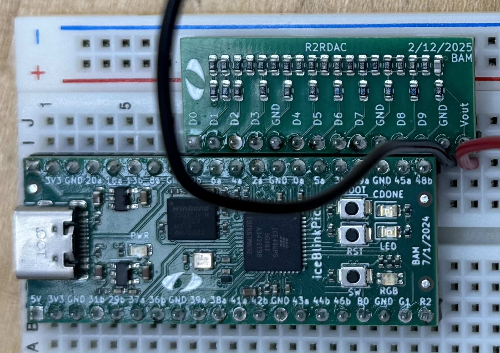
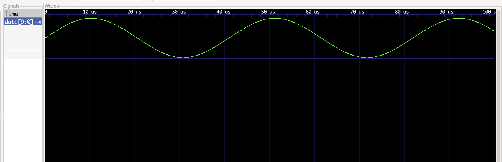

# Miniproject 3

Author: Enricco Gemha

Date: Mar 10th, 2025

To check the assignment instructions, please refer to the [assignment page](./instructions.md).

## Circuit Design

This circuit generates a sinusoidal waveform through a 10-bit R-2R ladder DAC using quarter-cycle symmetry to reduce memory from 512 to 128 samples (first quarter cycle). The physical circuit is implemented on a breadboard, as shown in the image below:



## How It Works

The circuit operates by generating addresses from 0-511, with a counter (9 bits). Then, it derives the quadrant (2 bits) and quarter-address (7 bits) from this counter, and accesses the memory for sample values.The memory output is then transformed based on the quadrant position to create the full sine wave.

## Symmetry Explanation

The symmetry cases in the sine function allow for this transformation. First, it applies horizontal symmetry, mirroring the curve from 0°-90° to a reflection on 90°-180° (backward reading in memory), and similarly between 270°-360° and 180°-270°. Second, it applies vertical symmetry, where the second half of the cycle (180°-360°) is an inverted version of the first half (0°-180°). This can be broken down into four quadrants:

- Quadrant 0 (0°-90°): Direct memory lookup
- Quadrant 1 (90°-180°): Reversed memory lookup
- Quadrant 2 (180°-270°): Inverted memory lookup
- Quadrant 3 (270°-360°): Inverted and reversed memory lookup

In the SystemVerilog code, the horizontal symmetry is controlled by `7'd127 - address[6:0]`, and the vertical symmetry by `10'd1024 - memory_data`. The implementation follows below:

```systemverilog
assign quadrant = address[8:7];
always_comb begin
    case(quadrant)
        2'b00: quarter_address = address[6:0];
        2'b01: quarter_address = 7'd127 - address[6:0];
        2'b10: quarter_address = address[6:0];
        2'b11: quarter_address = 7'd127 - address[6:0];
    endcase
end

always_comb begin
    case(quadrant)
        2'b00, 2'b01: data = memory_data;
        2'b10, 2'b11: data = 10'd1024 - memory_data;
    endcase
end
```

## Simulation Results



The simulation results show the expected behavior of the sine wave generator.

## Hardware Testing


The oscilloscope measurements confirm successful implementation with a clean waveform output, in the format of a sine wave with approximately 3.6V peak-to-peak amplitude.

## Conclusion

As confirmed by the simulation and hardware testing, this implementation successfully creates a more memory-efficient sine wave generation than the example provided (75% less), by the use of symmetries.

## Disclaimer

This project used ClaudeAI to assist the understanding of the project requirements. The author is responsible for the final content and correctness of the project.a
