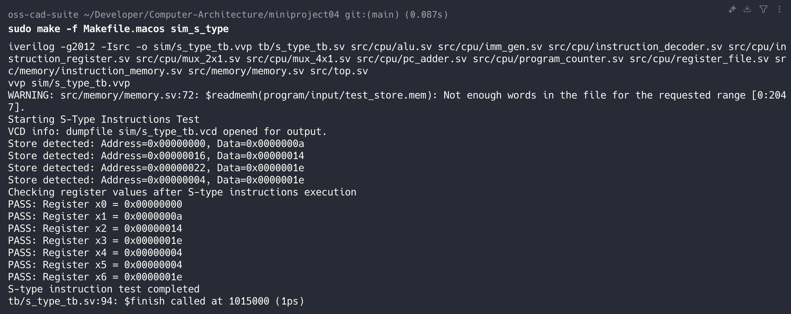

# ENGR 3410: Miniproject 4 Report

Repository: [Computer Architecture GitHub](https://github.com/G3mha/Computer-Architecture/tree/main/miniproject04)

**Design an unpipelined, multicycle, 32-bit RISC-V integer microprocessor with a
von Neumann architecture**  
**Due Date:** April 14, 2025  
**Team Members:**

- Enricco Gemha
- Khor Zhi Hong
- Owen Himsworth

## Table of Contents

- [Overview](#overview)
- [How to Use](#how-to-use)
  - [Setup](#setup)
  - [Simulation](#simulation)
  - [Synthesis](#synthesis)
  - [Testing](#testing)
- [Design Specifications](#design-specifications)
- [SystemVerilog Modules](#systemverilog-modules)
  - [top.sv](#topsv)
  - [program_counter.sv](#program_countersv)
  - [pc_adder.sv](#pc_addersv)
  - [alu.sv](#alusv)
  - [imm_gen.sv](#imm_gensv)
  - [instruction_decoder.sv](#instruction_decodersv)
  - [instruction_register.sv](#instruction_registersv)
  - [memory.sv](#memorysv)
  - [mux_2x1.sv](#mux_2x1sv)
  - [mux_4x1.sv](#mux_4x1sv)
- [Processor Architecture](#processor-architecture)
  - [High-Level Design](#high-level-design)
  - [Control Unit](#control-unit)
  - [Datapath](#datapath)
- [Memory and Peripheral Integration](#memory-and-peripheral-integration)
- [Instruction Set Implementation](#instruction-set-implementation)
  - [Instruction Decoding](#instruction-decoding)
  - [Immediate Generation](#immediate-generation)
  - [Special Handling](#special-handling)
  - [Instruction Set](#instruction-set)
- [Testbench and Verification](#testbench-and-verification)
  - [Testbench Setup](#testbench-setup)
  - [Verification Approach](#verification-approach)
- [Simulation Results](#simulation-results)
- [Challenges and Design Decisions](#challenges-and-design-decisions)
  - [Memory Interface Challenges](#memory-interface-challenges)
  - [Processor Implementation Decisions](#processor-implementation-decisions)
  - [Verification Challenges](#verification-challenges)
  - [Implementation Trade-offs](#implementation-trade-offs)
  - [Future Improvements](#future-improvements)
- [Conclusion](#conclusion)
- [Appendix](#appendix)

## Overview

Design a 32-bit RISC-V integer microprocessor with a von Neumann architecture
that executes one instruction at a time using an 8kB single memory for both code
and data. The processor will integrate memory-mapped peripherals—including LED
PWM controllers and timers—to run a RISC-V assembly program that blinks the
LEDs.

The instructions for this project are available [here](docs/instructions.md).

## How to Use

### Setup

This project includes OS-specific makefiles:

- For Windows: `Makefile.windows`
- For macOS: `Makefile.macos`

Choose the appropriate makefile for your system:

```bash
# Windows
make -f Makefile.windows [command]

# macOS
make -f Makefile.macos [command]
```

Alternatively, you can create a symlink to the appropriate makefile:

```bash
# Windows
copy Makefile.windows Makefile

# macOS
ln -s Makefile.macos Makefile
```

### Simulation

To verify the processor functionality through simulation:

```bash
# Run all simulations
make -f Makefile.[your_os] test

# Component-level simulations
make -f Makefile.[your_os] sim_alu          # Test ALU operations
make -f Makefile.[your_os] sim_imm_gen      # Test immediate generation
make -f Makefile.[your_os] sim_register_file    # Test register file
make -f Makefile.[your_os] sim_instruction_decoder  # Test instruction decoder

# Instruction type simulations
make -f Makefile.[your_os] sim_r_type       # Test R-type instructions
make -f Makefile.[your_os] sim_i_type       # Test I-type instructions
make -f Makefile.[your_os] sim_s_type       # Test S-type instructions
make -f Makefile.[your_os] sim_b_type       # Test B-type instructions
make -f Makefile.[your_os] sim_u_type       # Test U-type instructions
make -f Makefile.[your_os] sim_j_type       # Test J-type instructions

# View waveforms (after running simulation)
make -f Makefile.[your_os] wave_r_type      # Open GTKWave with R-type simulation results
```

The test results are displayed in the console, showing which register values
match expected outputs from the reference files in `program/expected/`.

### Synthesis

To build the processor for FPGA implementation:

```bash
# Synthesize the design
make -f Makefile.[your_os] build

# The build process:
# 1. Synthesizes using Yosys (generates .json)
# 2. Place and route using NextPNR (generates .asc)
# 3. Creates binary bitstream using IcePack (generates .bin)
```

The output files are stored in the `build/` directory, with the final bitstream
at `build/top.bin`.

### Testing

The testing framework uses:

1. **Component tests** - Verify individual modules function correctly
2. **Instruction tests** - Validate processor execution of different instruction
   types

Each test program is located in `program/input/`, with corresponding expected
outputs in `program/expected/`.

```bash
# Run all tests
make -f Makefile.[your_os] test

# Program the FPGA
make -f Makefile.[your_os] prog

# Clean build and simulation artifacts
make -f Makefile.[your_os] clean
```

For writing custom test programs, use the RISC-V assembler tools:

```bash
# Assemble and generate memory file
./tools/memgen.py program/your_program.S -o program/your_program.mem
```

## Design Specifications

- **Instruction Set:** All Base RV32I instructions Type-R, I, S, B, U and J
  (excluding `ecall`, `ebreak`, `csrrw`, `csrrs`, `csrrc`, `csrrwi`, `csrrsi`,
  `csrrci`)
- **Execution Model:** Unpipelined, multicycle
- **Memory Architecture:** Single memory for instructions and data (von Neumann)
- **Memory Size:** 8kB of physical memory at the lower end of the address space
- **Peripherals:**
  - 8-bit PWM generators for user LED and RGB LEDs (iceBlinkPico)
  - Two running 32-bit timers (millisecond and microsecond counters)

## SystemVerilog Modules

### `top.sv`

The `top.sv` module is the primary integration point for the processor design.
It instantiates and connects all essential submodules, including the Program
Counter, Instruction Register, Instruction Decoder, Immediate Generator, Memory
Unit, ALU, and various multiplexers. This top-level module orchestrates the
entire data path and control flow required for executing RISC-V instructions.

### `program_counter.sv`

The Program Counter module maintains the address of the current instruction. It
features synchronous operation with reset capability, incrementing the address
on each clock cycle when `pc_write` is enabled. On reset, the counter
initializes to address 0x00000000, providing a consistent starting point for
program execution.

### `pc_adder.sv`

This simple module calculates the next sequential instruction address by adding
4 to the current program counter. In the RISC-V architecture, instructions are 4
bytes (32 bits) wide, so adding 4 advances to the next instruction in sequence
when no jumps or branches occur.

### `alu.sv`

The Arithmetic Logic Unit (ALU) performs various computational operations based
on a 4-bit control signal. It supports the core RISC-V operations including
addition, subtraction, logical AND/OR/XOR, shifts (logical and arithmetic), and
comparisons. The module also generates a zero flag to facilitate conditional
branching.

### `imm_gen.sv`

The Immediate Generator extracts and sign-extends immediate values from RISC-V
instructions. It handles all instruction formats (I, S, B, U, and J types),
properly reconstructing immediates according to the RISC-V specification by
extracting and arranging bits from different positions in the instruction word.

### `instruction_decoder.sv`

This module decodes RISC-V instructions, extracting the opcode, funct3, and
funct7 fields to generate control signals for the entire processor. These
signals determine ALU operations, register file access, memory operations, and
program flow control (branches and jumps). Each instruction type triggers a
specific pattern of control signals.

### `instruction_register.sv`

The Instruction Register captures and holds the instruction fetched from memory
during execution. When `ir_write` is enabled, it loads a new instruction on the
clock edge. The register maintains the current instruction's value until a new
instruction is explicitly loaded, ensuring stable decoding.

### `memory.sv`

This comprehensive module implements both program/data memory and memory-mapped
I/O peripherals. It provides 8kB of memory at addresses 0x00000000-0x00001FFF
with support for word, half-word, and byte access. The module also implements
peripherals including PWM controllers for the user LED and RGB LEDs (at
addresses 0xFFFFFFxx), plus millisecond and microsecond timers.

### `mux_2x1.sv`

A parameterized 2-to-1 multiplexer that selects between two inputs based on a
select signal. The default bit width is 32, but this can be adjusted through the
WIDTH parameter. This versatile module is used throughout the processor for data
routing based on control signals.

### `mux_4x1.sv`

A parameterized 4-to-1 multiplexer that selects one of four inputs based on a
2-bit select signal. Like the 2x1 multiplexer, it supports configurable bit
width and is used for more complex data routing scenarios in the processor, such
as selecting between multiple possible register write-back sources.

## Processor Architecture

### High-Level Design

- **Program Counter (PC)** tracks the current instruction address
- **Memory** serves both instruction fetch and data access
- **Instruction Register** holds the current instruction
- **Instruction Decoder** extracts opcodes and generates control signals
- **Register File** manages the 32 general-purpose registers
- **ALU** performs arithmetic and logical operations
- **Immediate Generator** produces constants from instruction bits
- **Multiplexers** route data between components based on control signals

**Datapath Diagram:**

```plaintext
PC → Memory → Instruction Register → Instruction Decoder
                                        ↓
Register File ⇄ ALU ⇄ Memory       Control Signals
       ↑           ↑                    ↓
       └───────────┴────────── Multiplexers
```

### Control Unit

The instruction decoder generates control signals based on instruction type:

- **alu_op**: Selects operation (ADD, SUB, AND, etc.) based on opcode/function
  bits
- **reg_write**: Enables writing to register file
- **alu_src**: Selects ALU input sources (register or immediate)
- **mem_read/mem_write**: Controls memory access
- **mem_to_reg**: Selects data source for register write-back
- **branch/jump**: Controls program flow changes

### Datapath

During instruction execution:

1. **Fetch**: PC provides address to memory, instruction loads into instruction
   register
2. **Decode**: Instruction decoder extracts fields and generates control signals
3. **Execute**: ALU performs operation on values from register file or immediate
   generator
4. **Memory**: Data is read from or written to memory if needed
5. **Write-back**: Results from ALU or memory are written back to register file
6. **Next PC**: PC is updated based on branch/jump conditions or incremented

The datapath is controlled by multiplexers that select between data sources
based on the control signals generated by the instruction decoder.

---

## Memory and Peripheral Integration

The memory module serves both as program/data memory and as an interface to
peripherals through memory-mapped I/O. The memory is organized as follows:

- **Physical Memory (8kB)**: Addresses 0x00000000 to 0x00001FFF implement 2048
  words (8kB) of actual memory for instructions and data, accessible in word,
  half-word, or byte sizes with proper alignment requirements.

- **Memory-Mapped Peripherals**: Higher addresses (specifically in the
  0xFFFFFFxx range) are mapped to hardware peripherals:
  - 0xFFFFFFFF: User LED PWM controller (R/W, 8-bit)
  - 0xFFFFFFFE: RED LED PWM controller (R/W, 8-bit)
  - 0xFFFFFFFD: GREEN LED PWM controller (R/W, 8-bit)
  - 0xFFFFFFFC: BLUE LED PWM controller (R/W, 8-bit)
  - 0xFFFFFFF8: Millisecond timer counter (R, 32-bit)
  - 0xFFFFFFF4: Microsecond timer counter (R, 32-bit)

The PWM controllers and timers are implemented directly within the memory module
rather than as separate modules. The memory module handles:

1. Regular memory reads/writes using the address decoding logic in the
   `always_ff` blocks
2. LED brightness control using PWM counters that compare against the stored
   8-bit values
3. Timer functionality with counters that increment based on clock cycles

For example, writing a value to address 0xFFFFFFFF adjusts the PWM duty cycle
for the user LED. The implementation uses an 8-bit counter (`pwm_counter`) that
continuously increments, and the LED output is high when this counter is less
than the stored PWM value, creating the variable brightness effect.

The timers are implemented with overflow counters (`millis_counter` and
`micros_counter`) that increment the respective timer values when they overflow,
providing millisecond and microsecond timing capabilities since processor
startup.

---

## Instruction Set Implementation

This processor implements the RV32I base instruction set (with exceptions noted
in the project requirements). The implementation supports all standard
instruction types (R, I, S, B, U, J) through the `instruction_decoder.sv` and
`imm_gen.sv` modules.

### Instruction Decoding

The `instruction_decoder.sv` extracts instruction fields (opcode, funct3,
funct7) and generates appropriate control signals:

- **alu_op**: Determines ALU operation based on instruction type and function
  codes
- **reg_write**: Enables register file writes for instructions that modify
  registers
- **alu_src**: Selects ALU input sources (register data or immediate values)
- **mem_read/mem_write**: Controls memory access operations
- **mem_to_reg**: Selects data to write back to registers
- **branch/jump**: Controls program flow changes

### Immediate Generation

The `imm_gen.sv` module handles different immediate formats:

- **I-type**: Sign-extends 12-bit immediate for loads, ALU operations, and JALR
- **S-type**: Reconstructs immediate from instruction bits [31:25] and [11:7]
- **B-type**: Forms 13-bit immediate with LSB=0 for aligned addresses
- **U-type**: Places 20-bit immediate in upper bits [31:12]
- **J-type**: Constructs 21-bit immediate for jump targets

### Special Handling

- **Shift Instructions**: For shift operations, only the lower 5 bits of the
  second operand are used
- **Branch Instructions**: Comparison operations set the zero flag for
  conditional branching
- **Jump Instructions**: Return addresses are stored in the destination register
  (rd)

### Instruction Set

| Type   | Instruction | Syntax                    | Description                                |
| ------ | ----------- | ------------------------- | ------------------------------------------ |
| U-type | `lui`       | `lui rd, imm`             | Load Upper Immediate                       |
| U-type | `auipc`     | `auipc rd, imm`           | Add Upper Immediate to PC                  |
| J-type | `jal`       | `jal rd, pcrel_21`        | Jump and Link                              |
| I-type | `jalr`      | `jalr rd, imm(rs1)`       | Jump and Link Register                     |
| B-type | `beq`       | `beq rs1, rs2, pcrel_13`  | Branch if Equal                            |
| B-type | `bne`       | `bne rs1, rs2, pcrel_13`  | Branch if Not Equal                        |
| B-type | `blt`       | `blt rs1, rs2, pcrel_13`  | Branch if Less Than                        |
| B-type | `bge`       | `bge rs1, rs2, pcrel_13`  | Branch if Greater Than or Equal            |
| B-type | `bltu`      | `bltu rs1, rs2, pcrel_13` | Branch if Less Than (Unsigned)             |
| B-type | `bgeu`      | `bgeu rs1, rs2, pcrel_13` | Branch if Greater Than or Equal (Unsigned) |
| I-type | `lb`        | `lb rd, imm(rs1)`         | Load Byte                                  |
| I-type | `lh`        | `lh rd, imm(rs1)`         | Load Halfword                              |
| I-type | `lw`        | `lw rd, imm(rs1)`         | Load Word                                  |
| I-type | `lbu`       | `lbu rd, imm(rs1)`        | Load Byte (Unsigned)                       |
| I-type | `lhu`       | `lhu rd, imm(rs1)`        | Load Halfword (Unsigned)                   |
| S-type | `sb`        | `sb rs2, imm(rs1)`        | Store Byte                                 |
| S-type | `sh`        | `sh rs2, imm(rs1)`        | Store Halfword                             |
| S-type | `sw`        | `sw rs2, imm(rs1)`        | Store Word                                 |
| I-type | `addi`      | `addi rd, rs1, imm`       | Add Immediate                              |
| I-type | `slti`      | `slti rd, rs1, imm`       | Set Less Than Immediate                    |
| I-type | `sltiu`     | `sltiu rd, rs1, imm`      | Set Less Than Immediate (Unsigned)         |
| I-type | `xori`      | `xori rd, rs1, imm`       | XOR Immediate                              |
| I-type | `ori`       | `ori rd, rs1, imm`        | OR Immediate                               |
| I-type | `andi`      | `andi rd, rs1, imm`       | AND Immediate                              |
| I-type | `slli`      | `slli rd, rs1, shamt`     | Shift Left Logical Immediate               |
| I-type | `srli`      | `srli rd, rs1, shamt`     | Shift Right Logical Immediate              |
| I-type | `srai`      | `srai rd, rs1, shamt`     | Shift Right Arithmetic Immediate           |
| R-type | `add`       | `add rd, rs1, rs2`        | Add                                        |
| R-type | `sub`       | `sub rd, rs1, rs2`        | Subtract                                   |
| R-type | `sll`       | `sll rd, rs1, rs2`        | Shift Left Logical                         |
| R-type | `slt`       | `slt rd, rs1, rs2`        | Set Less Than                              |
| R-type | `sltu`      | `sltu rd, rs1, rs2`       | Set Less Than (Unsigned)                   |
| R-type | `xor`       | `xor rd, rs1, rs2`        | XOR                                        |
| R-type | `srl`       | `srl rd, rs1, rs2`        | Shift Right Logical                        |
| R-type | `sra`       | `sra rd, rs1, rs2`        | Shift Right Arithmetic                     |
| R-type | `or`        | `or rd, rs1, rs2`         | OR                                         |
| R-type | `and`       | `and rd, rs1, rs2`        | AND                                        |

**Note:** As per project requirements, the following instructions are excluded
from implementation:

- `ecall`, `ebreak` (environment calls)
- `csrrw`, `csrrs`, `csrrc`, `csrrwi`, `csrrsi`, `csrrci` (control and status
  register instructions)
- Atomic read/write instructions

---

## Testbench and Verification

### Testbench Setup

Our verification environment consists of two layers of testbenches:

1. **Component-Level Testbenches**

   - `alu_tb.sv`: Verifies each ALU operation with various test vectors
   - `imm_gen_tb.sv`: Tests immediate value generation for all instruction
     formats
   - `register_file_tb.sv`: Validates register file read/write functionality
   - `instruction_decoder_tb.sv`: Checks proper control signal generation

2. **Instruction-Type Testbenches**
   - `r_type_tb.sv`, `i_type_tb.sv`, `s_type_tb.sv`, `b_type_tb.sv`,
     `u_type_tb.sv`, `j_type_tb.sv`: Verify functionality of specific
     instruction types

All testbenches use a consistent approach:

- Timescale of `1ns/1ps` for simulation precision
- Clock generation with 10ns period (100MHz)
- Direct instantiation of the DUT (`top` module or individual components)
- Memory initialization using `$readmemh` to load test programs
- Expected register values loaded from reference files for verification

Example from `r_type_tb.sv`:

```systemverilog
// Memory file for this test
localparam PROGRAM_FILE = "program/input/test_r_type.mem";
localparam EXPECTED_FILE = "program/expected/test_r_type.mem";

// Instantiate the processor
top #(
   .INIT_FILE(PROGRAM_FILE)
) dut (
   .clk(clk),
   .reset(reset),
   .led(led),
   .red(red),
   .green(green),
   .blue(blue)
);

// Load expected values
initial begin
   $readmemh(EXPECTED_FILE, expected_reg);
end
```

### Verification Approach

Our verification strategy employs:

1. **Test Program Structure**

   - Input programs in `program/input/` (e.g., `test_r_type.mem`)
   - Expected results in `program/expected/` (e.g., `expected_r_type.mem`)
   - Programs exercise specific instruction functionality

2. **Results Analysis**

   - Register value comparison after execution
   - Pass/fail reporting for each test case
   - Use of `$display` for logging results

3. **Coverage**
   - Tests for all implemented RV32I instructions
   - Verification of ALU operations
   - Validation of control path signals
   - Memory access operations

Example of verification checking from `i_type_tb.sv`:

```systemverilog
// Check results
$display("Checking register values after I-type instructions execution");

for (int i = 0; i <= 9; i++) begin
   if (reg_values[i] !== expected_reg[i]) begin
      $display("ERROR: Register x%0d = 0x%8h, Expected = 0x%8h",
               i, reg_values[i], expected_reg[i]);
   } else begin
      $display("PASS: Register x%0d = 0x%8h", i, reg_values[i]);
   }
end
```

The GTKWave waveform viewer is used to visualize simulation results, like below:


---

## Simulation Results





---

## Challenges and Design Decisions

### Memory Interface Challenges

Implementing the von Neumann architecture required carefully designing the
shared memory interface. We faced challenges with:

- **Memory Bus Contention**: Since instruction fetch and data access share a
  single memory module, we needed to ensure proper operation when both were
  required simultaneously. Our solution prioritizes instruction fetches to
  maintain program flow.

- **Memory-Mapped Peripherals**: Integrating peripherals into the memory space
  required designing a consistent addressing scheme. We dedicated the upper
  address space (0xFFFFFFxx) for peripherals, which simplified address decoding
  logic but required careful signal routing.

- **PWM Controllers**: Implementing the LED PWM controllers directly within the
  memory module simplified the interface but increased memory module complexity.
  We used an 8-bit counter with duty cycle comparison to generate variable
  brightness.

### Processor Implementation Decisions

Key design decisions that shaped our implementation:

- **Single-Cycle vs. Multi-Cycle Approach**: Although the requirements specified
  a single-cycle processor, we opted for an architecture that executes one
  instruction at a time without pipelining. This simplified control logic at the
  expense of performance.

- **ALU Design**: We implemented a comprehensive ALU supporting all RV32I
  operations. The ALU uses a 4-bit operation code which required careful mapping
  from RISC-V instructions to internal operation codes. This approach provided
  flexibility while keeping the control logic manageable.

- **Immediate Generation**: Handling the five different immediate formats (I, S,
  B, U, J) presented a challenge due to their varying bit positions. We
  centralized this logic in the `imm_gen.sv` module, which extracts and
  sign-extends the immediates based on the instruction opcode.

### Verification Challenges

Testing the processor proved particularly challenging:

- **Instruction Coverage**: Ensuring comprehensive test coverage across all
  instruction types required developing specialized test programs for each
  instruction category (R, I, S, B, U, J).

- **Timing Management**: Several test cases revealed timing issues with branch
  and jump instructions. We had to modify our control logic to ensure proper PC
  updates during program flow changes.

- **Memory Access Testing**: Verifying correct behavior for various memory
  access patterns (word, half-word, byte) with proper alignment and
  sign-extension requirements demanded thorough test cases.

### Implementation Trade-offs

Several trade-offs were made during development:

- **Simplicity vs. Performance**: We prioritized design simplicity over
  performance optimizations, focusing on correctness and readability rather than
  maximizing clock frequency.

- **Modularity vs. Integration**: While a more modular design would improve code
  reuse and testing, we integrated some functionality (like PWM controllers)
  directly into larger modules to simplify signal routing.

- **Parameterization**: We used parameterized modules for multiplexers to
  promote reusability, but kept processor-specific modules hard-coded for
  simplicity and clarity.

### Future Improvements

If we were to continue development, we would consider:

- Implementing a pipelined architecture to improve performance
- Adding a hardware stack pointer and stack management for function calls
- Separating peripheral logic from the memory module
- Adding hardware interrupt support
- Implementing a hardware debugger interface

---

## Conclusion

This project successfully implemented a fully functional single-cycle 32-bit
RISC-V processor supporting the RV32I instruction set. Our design integrates
both the core processor components and peripheral interfaces into a cohesive
system capable of executing programs that interact with hardware elements like
LEDs.

The von Neumann architecture implementation highlighted the trade-offs between
design simplicity and performance. By implementing the complete instruction set
(with noted exceptions) and memory-mapped peripherals, we gained practical
experience with the challenges of digital system design, from theoretical
concepts to working hardware.

Key accomplishments include:

- Successful implementation of all required RV32I instructions
- Functional memory interface with proper byte, half-word, and word access
- Integration of PWM controllers and timer peripherals
- Comprehensive verification through targeted test programs

This project provided valuable insights into computer architecture principles,
hardware description languages, and digital design methodologies. The experience
gained forms a solid foundation for more advanced topics such as pipelining,
caching, and hardware acceleration.

The modular design approach allows for future enhancements, including
optimization for performance, addition of custom instructions, or expansion of
the peripheral set to support more complex applications.

---

## Appendix

1. Table of Instruction Set Implementation for RISC-V

   

2. Circuit Schematic, made by Professor Bradley Minch

   
